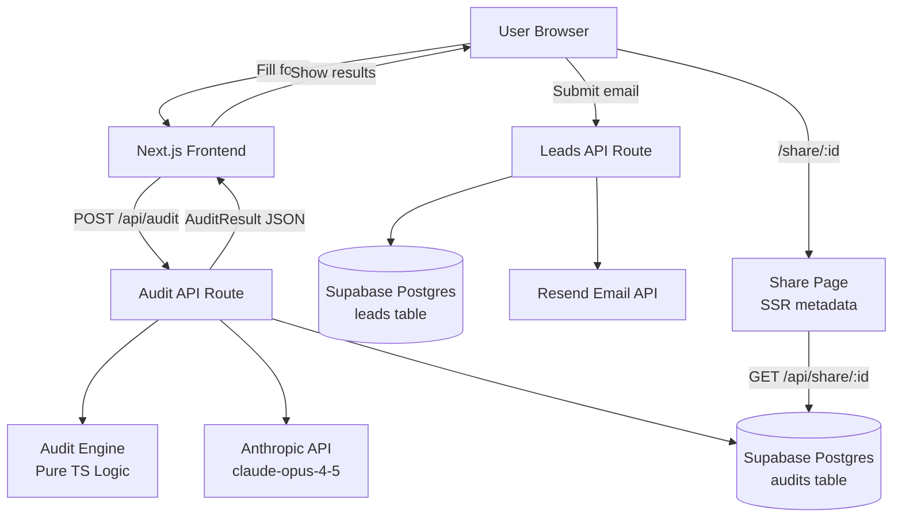

# Architecture

## System Diagram

## Data Flow

1. **User fills form** → React state + localStorage persistence
2. **Submit** → `POST /api/audit` with `{tools[], teamSize, useCase}`
3. **Audit engine** runs rule-based logic per tool (pure TypeScript, no AI)
4. **Anthropic API** generates 80-100 word personalized summary (fallback: template)
5. **Result stored** in Supabase `audits` table with unique nanoid
6. **JSON returned** to frontend, rendered as results page
7. **Email capture** → `POST /api/leads` → Supabase `leads` table + Resend transactional email
8. **Share URL** → `/share/[id]` → SSR page fetches public-safe audit data, renders OG meta

## Stack Choices

| Layer | Choice | Why |
|---|---|---|
| Framework | Next.js 14 App Router | SSR for OG tags, API routes co-located, Vercel deploy |
| Language | TypeScript | Type safety on audit logic catches bugs at compile time |
| Styling | Tailwind CSS | Utility-first, no CSS bundle bloat, fast to iterate |
| Database | Supabase (Postgres) | Real SQL, free tier, no vendor lock-in, auditable schema |
| AI | Anthropic claude-opus-4-5 | Required by spec; graceful fallback on failure |
| Email | Resend | 3k free/month, zero-config, developer-first |
| Deploy | Vercel | Native Next.js, automatic preview deploys |
| Tests | Jest | Standard, built into Next.js ecosystem |

## What I'd Change at 10k Audits/Day

- **Queue the AI summary** — Move Anthropic API call to a background job (BullMQ/Inngest). At 10k/day, synchronous LLM calls would increase p99 latency and cost.
- **Redis rate limiting** — Current in-memory rate limiter resets on restart. Replace with Redis (Upstash) for distributed, persistent rate limiting.
- **Edge caching** — Cache shared audit pages at the CDN layer (Vercel Edge) — they're public and immutable.
- **Read replicas** — Supabase supports read replicas. Route share page reads to replica to avoid write contention.
- **Audit versioning** — Track pricing data version used per audit so historical audits remain accurate when pricing changes.
